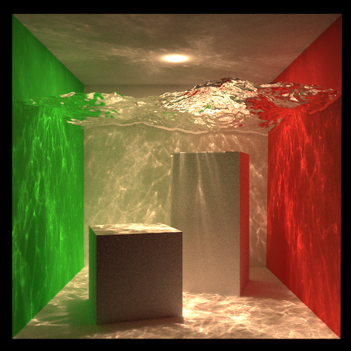

# photon_mapping

minimal but extensible header only implementation of photon mapping in C++.

original git: 

# How to compile:
create and activate the conda environment:
```bash
conda env create -f environment.yml
conda activate photonmap
```
To install as a Python library:
```bash
python -m pip install ./
```

To compile the source code without installing (useful for debugging):
```bash
mkdir ./build && cd ./build
cmake -DCMAKE_BUILD_TYPE=Debug ../
make -j
```



## Features

* Direct illumination with explicit light sampling
* Indirect illumination with final gathering
* Caustics photon map
* Reference path tracing integrator
* Load obj model

## Requirements

* C++ (20>=)
* CMake (3.20>=)
* OpenMP
* [Embree](https://github.com/embree/embree) (>=3)

## Externals

* [Embree](https://github.com/embree/embree)
* [tinyobjloader](https://github.com/tinyobjloader/tinyobjloader)

## References

* Jensen, Henrik Wann. Realistic image synthesis using photon mapping. AK Peters/crc Press, 2001.
* https://pbr-book.org/3ed-2018/Light_Transport_III_Bidirectional_Methods/Stochastic_Progressive_Photon_Mapping# 
* http://www.cs.cmu.edu/afs/cs/academic/class/15462-s12/www/lec_slides/lec18.pdf
* [memoRANDOM](https://rayspace.xyz/)
* [McGuire Computer Graphics Archive](http://casual-effects.com/data/)
* [Rendering Resources | Benedikt Bitterli's Portfolio](https://benedikt-bitterli.me/resources/)
* [Jensen, Henrik Wann. "Global illumination using photon maps." Eurographics workshop on Rendering techniques. Springer, Vienna, 1996.](https://link.springer.com/chapter/10.1007/978-3-7091-7484-5_3)
* Veach, Eric. Robust Monte Carlo methods for light transport simulation. Stanford University, 1998.
* [Christensen, Per H. "Faster photon map global illumination." Journal of graphics tools 4.3 (1999): 1-10.](https://doi.org/10.1080/10867651.1999.10487505)
* [Hachisuka, Toshiya, Jacopo Pantaleoni, and Henrik Wann Jensen. "A path space extension for robust light transport simulation." ACM Transactions on Graphics (TOG) 31.6 (2012): 1-10.](https://dl.acm.org/doi/10.1145/2366145.2366210)
