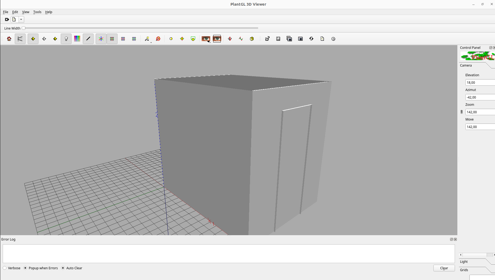
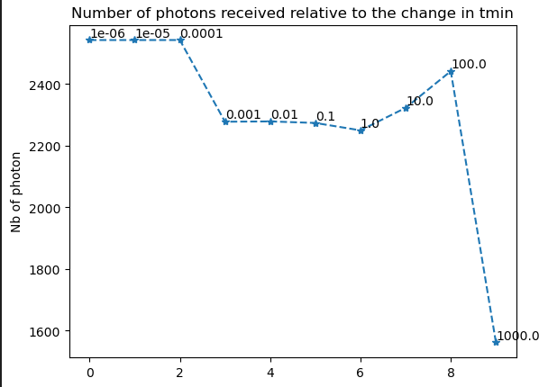

User guide
##########

Input files
===========

Configuration file
------------------

| The file simulation.ini contains all the basic configurations to run a simulation. 
|
| Here are the different variables that you can configure: 

+------------------------+---------------+----------------------------------------------------------------------+
| Configuration name     | Data type     | Description                                                          |
+========================+===============+======================================================================+
| NB_PHOTONS             | int           | The number of photons used in the simulation                         |
+------------------------+---------------+----------------------------------------------------------------------+
| MAXIMUM_DEPTH          | int           | | The maximum number of times that the light bounces                 |
|                        |               | | in the scene                                                       |
+------------------------+---------------+----------------------------------------------------------------------+
| SCALE_FACTOR           | int           | | The size of geometries. The vertices of geometries                 |
|                        |               | | is recalculated by dividing their coordinates by                   |
|                        |               | | this value                                                         |
+------------------------+---------------+----------------------------------------------------------------------+
| T_MIN                  | float         | | The minimum distance between the point of                          |
|                        |               | | intersection and the origin of the light ray                       |
+------------------------+---------------+----------------------------------------------------------------------+
| NB_THREAD              | int           | | The number of threads on the CPU used to calculate in              |
|                        |               | | parallel. This value is between 0 and the number of                |
|                        |               | | cores of your CPU.                                                 |
+------------------------+---------------+----------------------------------------------------------------------+
| BACKFACE_CULLING       | yes/no        | | Define which mode of intersection is chosen: intersect             |
|                        |               | | only with the front face (yes) or intersect with both              |
|                        |               | | faces (no)                                                         |
+------------------------+---------------+----------------------------------------------------------------------+
| BASE_SPECTRAL_RANGE    | int int       | | The base spectral range which includes all the other               |
|                        |               | | spectral ranges. The first value is the start of band              |
|                        |               | | and the second is the end of band. Ex: 100 200                     |                               
+------------------------+---------------+----------------------------------------------------------------------+
| DIVIDED_SPECTRAL_RANGE | int [int int] | | The list of spectral ranges divided from the base                  |
|                        |               | | spectral range. The first value is the number of                   |
|                        |               | | divided parts, the value start and end of band is                  |
|                        |               | | continue right after. These bands have to be smaller               |
|                        |               | | than the base spectral range. Ex: 2 100 150 150 200                |
+------------------------+---------------+----------------------------------------------------------------------+

| This is an example of defining a configuration file.

.. code-block:: bash
    
    $NB_PHOTONS 1000000000
    $MAXIMUM_DEPTH 50
    $SCALE_FACTOR 1
    $T_MIN 0.1
    $NB_THREAD 8
    $BACKFACE_CULLING yes
    $BASE_SPECTRAL_RANGE 400 800
    $DIVIDED_SPECTRAL_RANGE 2 600 655 655 665

Room file
---------

| At this version, only files of type ``.rad`` is supported by our tool.
|
| To define an object in a ``.rad`` file, there are two steps:
|
| Firstly, we have to define the material object


.. code-block:: bash
    
    void material_type material_name
    0
    0
    material_data

| Secondly, we will define an object with the name of a defined material and its geometries
| Multiple objects can be defined from a single material

.. code-block:: bash
    
    material_name geometry_type object_name
    0
    0
    geometry_data

| For each ``geometry_type`` and ``material_type``, we will have the different ways to define the ``geometry_data`` and ``material_data``
| This is an example of a file .rad with the geometry type ``polygon`` and the material type ``metal`` 

.. code-block:: bash

    void metal Sol
    0
    0
    5
    0.37047683515999996 0.37047683515999996 0.37047683515999996 0.100 0

    Sol polygon dallage
    0
    0
    12
    0.0 0.0 0
    2400.0 0.0 0
    2400.0 1840.0 0
    0.0 1840.0 0

| More informations of the files ``.rad`` can be found in this file `refman.pdf <https://github.com/openalea-incubator/photon_mapping/tree/main/docs/refman.pdf>`_

Optical property files
----------------------

The files containing the optical properties are saved in this structure of folder:

| .
| ├── Specularities.xlsx
| ├── Env
| │   ├── ReflectancesMean
| │   │   ├── .csv files
| │   ├── TransmittancesMean
| │   │   ├── .csv files
| ├── Plant
| │   ├── ReflectancesMean
| │   │   ├── .csv files
| │   ├── TransmittancesMean
| │   │   ├── .csv files

| The file Specularities.xlsx is used to define the specularities of the materials. These values represent the average specularities for all the wavelength.
|
| Here is an example of this file


+---------------------+-----------------------------+
| Materiau            | Valeur estimee visuellement |
+=====================+=============================+
| Aquanappe           | 0.1                         |
+---------------------+-----------------------------+
| CentrePlafond       | 0.5                         |
+---------------------+-----------------------------+
| CorniereAlu         | 0.3                         |
+---------------------+-----------------------------+
| PiedsTablette       | 0.3                         |
+---------------------+-----------------------------+
| MiroirCaissonLampes | 0.4                         |
+---------------------+-----------------------------+

| The folder Env contains the files .csv which define the average reflection and average transmission for each wavelength of the environment's objects. 
| These objects are rarely changing during the process of experiment. 
| Whereas, the files .csv inside the folder Plant is using to define these optical properties of captor/plant. 
| The amount of received energies is calculated on these objects. 
| It is important to notice that the name of the .csv files is the same as the name of material which is defined in the room file (.rad)
|
| For example:

+------------+------------+
| lambda     | moy        |
+============+============+
| 300        | 0.126      |
+------------+------------+
| 301        | 0.135      |
+------------+------------+
| 302        | 0.145      |
+------------+------------+
| ...        | ...        |
+------------+------------+

Captor file
-----------

| In our tool, we have a csv file defining the position and orientation of each captor. 
| It goes as follows:

+-------+-------+-------+----------------+--------+--------+--------+
| X     | Y     | Z     | rayon_capteur  | Xnorm  | Ynorm  | Znorm  |
+=======+=======+=======+================+========+========+========+
| 110   | 930   | 1000  | 10             | 0      | 0      | 1      |
+-------+-------+-------+----------------+--------+--------+--------+
| 210   | 930   | 1000  | 10             | 0      | 0      | 1      |
+-------+-------+-------+----------------+--------+--------+--------+
| 310   | 930   | 1000  | 10             | 0      | 0      | 1      |
+-------+-------+-------+----------------+--------+--------+--------+
| ...   | ...   | ...   | ...            | ...    | ...    | ...    |
+-------+-------+-------+----------------+--------+--------+--------+

Plant file
----------

| To add a plant to the simulation, we use the Lpy to define the structure of a plant.
| More informations can be found in this link https://lpy.readthedocs.io/en/latest/index.html

Spectral heterogeneity file 
---------------------------

| The spectral heterogeneity file contains the informations of the heterogeneity of the spectrum. In this file, there are the values of energies calculated en umol/m²/s which represent the flow of photons on each wavelength
|
| This is an example of this file

+----------------+-----------------------------------+
| wavelength(nm) | measured PPFD (umol m-2 s-1 nm-1) |
+================+===================================+
| 401            | 0.0555                            |
+----------------+-----------------------------------+
| 403            | 0.086                             |
+----------------+-----------------------------------+
| 405            | 0.14                              |
+----------------+-----------------------------------+
| ...            | ...                               |
+----------------+-----------------------------------+

Calibration points file  
-----------------------

| The calibration points file contains the captors which is used to convert the results from a number of photons to irradiance. This function only work for the simulation with captors.
|
| This is an example of this file

+-------+-------+-------+------------------+-------------------+------+-------------------+
| X     | Y     | Z     | Nmes_start1_end1 | Nmes_start2_end2  | ...  | Nmes_startn_endn  |
+=======+=======+=======+==================+===================+======+===================+
| 610   | 1330  | 1400  | 3.91336          | 19.6182           | ...  | value_1           |
+-------+-------+-------+------------------+-------------------+------+-------------------+
| 710   | 1330  | 1400  | 4.17343          | 20.8869           | ...  | value_2           |
+-------+-------+-------+------------------+-------------------+------+-------------------+
| 1210  | 1330  | 1400  | 3.80179          | 18.8231           | ...  | value_3           |
+-------+-------+-------+------------------+-------------------+------+-------------------+
| ...   | ...   | ...   | ...              | ...               | ...  | ...               |
+-------+-------+-------+------------------+-------------------+------+-------------------+


Run a simple simulation
=======================

These are the basic steps to run a simple light simulation with this tool:

Setup input files
-----------------

Create a configuration file (simulation.ini)

.. code-block:: bash
    
    $NB_PHOTONS 1000000000
    $MAXIMUM_DEPTH 50
    $SCALE_FACTOR 1
    $T_MIN 0.1
    $NB_THREAD 8
    $BACKFACE_CULLING yes
    $BASE_SPECTRAL_RANGE 400 800
    $DIVIDED_SPECTRAL_RANGE 2 600 655 655 665

Create a room file (testChamber.rad) with only one light

.. code-block:: bash

    void light lum400
    0
    0
    3
    0.4 0.4 0.4

    lum400 cylinder lamp
    0
    0
    7
    715.62 1670.0 2105.0
    743.193 1670.0 2105.0
    0.1

Create a captor file (captors_expe1.csv) with only one captor

.. code-block:: bash

    X,Y,Z,rayon_capteur,Xnorm,Ynorm,Znorm
    110,930,1000,10,0,0,1

| Create a folder ``./PO`` to save the optical property of all the object. To simplify, we can leave it empty for now.

The calibration points file and spectral heterogeneity file are optional.

Write the core program
----------------------

Create a python file (main.py) which contains the core program

.. code-block:: python

    from openalea.photonmap.Simulator import *

    if __name__ == "__main__":

        simulator = Simulator()
        simulator.readConfiguration("simulation.ini")
        simulator.addEnvFromFile("testChamber.rad", "./PO")
        simulator.addVirtualDiskCaptorsFromFile("captors_expe1.csv")
        res = simulator.run()
        res.writeResults() #write results to a file

Run and results
---------------

| To run the program, you need to install the tools by following this `guide <installing.html>`_.
|
| Activate the conda environment and run the program.

.. code-block:: bash

    conda activate env_name
    python main.py

| The result is a csv file saved in the folder ``./result``. This is an example of result.

+-----+----------------+----------------+
| id  | N_sim_600_655  | N_sim_655_665  |
+=====+================+================+
| 0   | 13635          | 13966          |
+-----+----------------+----------------+

Calibrate the results
=====================

| After running the simulation, we will obtain a result with the number of photons received on each captors or organes of plant. But in reality, to using this result to do the further researchs, we have to convert the unit of the current result to a unit which is more physical.
|
| To do that, after finishing the simulation, we will do the calibration the result by using the function ``calibrateResults``.

.. code-block:: python

    calibrated_res = simulator.calibrateResults("spectrum/chambre1_spectrum", "points_calibration.csv")
    calibrated_res.writeResults() #write results to a file

| To making this function works properly, we need two input files: the spectral heterogeneity file and the calibration points file. 
|
| In our tool, for each simulation of each spectral range, we will always run the same simulation of photon mapping. So the result final isn't include the factor of spectral heterogeneity. That is why we need the spectral heterogeneity file to correct the final results of simulation before doing the calculations before that.
|
| After correcting the factor of heterogeneity, we will calibrate the result by using the calibration point file. This file contains the received energies measured in reality on the positions of some captors which is used in the simulation. With these values, we will use the method ``Linear Regression`` to calculate the coefficients to convertir the results of simulation to irradiance (a unit used to measure the power of energy).
|
| This function is only working with the simulation of captors. 

Visualize the room
===================

To visualize the room, after defining the input files, we use a function named ``visualiserSimulationScene``. Here is the complete code for this program:

.. code-block:: python

    from openalea.photonmap.Simulator import *

    if __name__ == "__main__":

        simulator = Simulator()
        simulator.readConfiguration("simulation.ini")
        simulator.addEnvFromFile("testChamber.rad", "./PO")
        simulator.addVirtualDiskCaptorsFromFile("captors_expe1.csv")
        simulator.visualiserSimulationScene("ipython")

To obtain the 3D scene, we have to run this program through ```ipython```.

.. code-block:: bash

    ipython
    %gui qt5
    run main.py

| Here is the plantGL interface to visualize the scene



Test value Tmin
================

| While running the simulation, we risk encountering the problem of auto-intersection if the value of ``Tmin`` is too small.
| To avoid this problem, we've created a function to run the simulation with different values of ``Tmin``. The result of this function is a graph showing the change in the number of photons after testing different values of ``Tmin``.
|
| Here is the complete code for this program:

.. code-block:: python

    from openalea.photonmap.Simulator import *

    if __name__ == "__main__":

        simulator = Simulator()
        simulator.readConfiguration("simulation.ini")
        simulator.addEnvFromFile("testChamber.rad", "./PO")
        simulator.addVirtualDiskCaptorsFromFile("captors_expe1.csv")        
        simulator.test_t_min(int(1e6), 1e-6, 10, True)

| Here is a example of result



| We can find out the suitable range of value Tmin by finding the range where the result is the most stable (not changing). In this graph above, we can see that when the value tmin is between 0.001 and 100, our simulation doesn't encountering the problem of auto-intersection.